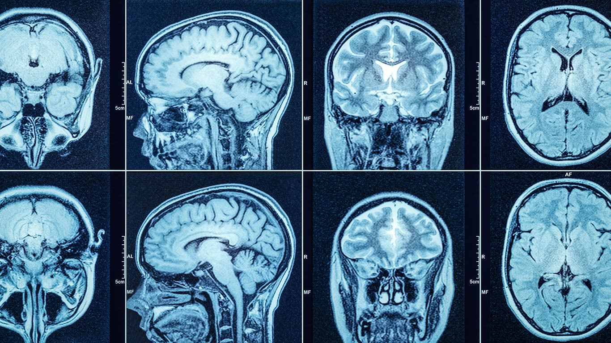

# **Grey Level Slicing in C**  
  

## **Description 💻**
A picture is divided into levels of intensity (brightness) using the digital image processing technique known as "grey level slicing," and certain levels are then chosen for additional examination. In order to enhance, segment, and extract characteristics from a picture, it is utilized to emphasize some elements while suppressing others. In areas including medical imaging, remote sensing, and security, grey-level slicing is a popular and efficient technique for image analysis. It enables a clear difference between the various image intensity levels and can offer important information that would otherwise be hard to 
get. The method entails segmenting an image into contiguous intensity levels, presenting them as binary pictures, and choosing certain levels for subsequent processing.
<table>
    <tr>
    <th>With Background</th>
    <th>Without Background</th>
    </tr>
    <tr>
    <td></td>
    <td></td>
    </tr>
</table>

## **Usage ⚙️**
 - Use  any online software to convert image to .ppm file. 
 - Run the respective program and enter the file path, lower limit, and upper limit. 
 - Use any online viewer to view the output image. 
## **Screenshots 🖼️**

**Lower Limit : 220**  
**Higher Limit : 255**  
  
  
  
    
  
    
**Lower Limit : 120**  
**Higher Limit : 240**    
  
<table>
  <tr>
    <td></td>
    <td></td>
    <td></td>
  </tr>
</table>